# Yalla BFF — Complete Architecture & Request Flow

> This document describes the current implementation of the Yalla Backend for Frontend.
> It is generated from the actual project structure and source code.

## 1. What is the Yalla BFF?

Yalla's BFF is the browser-facing boundary between the Angular application and the Integration Layer. It owns the browser's opaque, HttpOnly session cookie; keeps user access/refresh tokens server-side in Redis; acquires the shared WSO2 Integration Token; and forwards application requests to the Integration Layer.

It also performs synchronous OpenAI text moderation before the four configured post/comment write operations are forwarded. It does **not** contain domain entities, database access, group/post/comment business rules, or backend authorization policy.

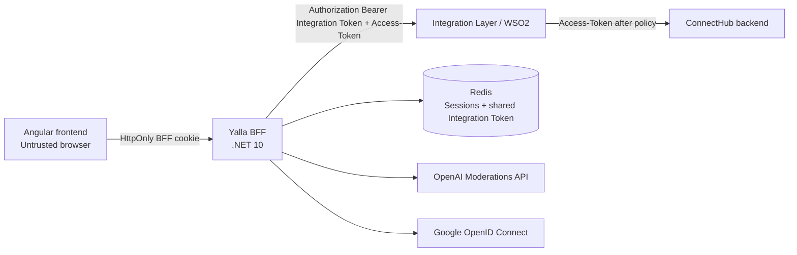

### Responsibility boundaries

| Component | Current responsibility |
| --- | --- |
| Angular | Calls BFF endpoints; relies on cookie credentials; does not store application, Integration, Google, or OpenAI tokens. |
| BFF | Session management, authentication boundary, OpenID Connect client, token lifecycle, controlled proxying, moderation, health checks. |
| Integration Layer / WSO2 | Validates the shared Integration Token and applies its forwarding policy. |
| Backend | Business logic and authorization after WSO2 forwarding. |
| OpenAI | Returns a moderation decision for text submitted only on configured routes. |
| Google | Authenticates the external identity through OIDC. |

## 2. Project structure

```text
BFF/
├── BFF.Tests/
│   ├── BFF.Tests.csproj
│   ├── IntegrationTokenServiceTests.cs
│   └── OpenAiContentModerationServiceTests.cs
├── Configuration/
│   └── BffOptions.cs
├── Controllers/
│   ├── AuthController.cs
│   └── ProxyController.cs
├── Health/
│   └── RedisHealthCheck.cs
├── Middleware/
│   └── ErrorHandlingMiddleware.cs
├── Models/
│   ├── Auth/
│   └── Sessions/
├── Properties/
│   └── launchSettings.json
├── Services/
│   ├── Authentication/
│   ├── Google/
│   ├── Integration/
│   ├── Moderation/
│   └── Sessions/
├── appsettings.json
├── appsettings.Development.json
├── BFF.csproj
├── BFF.slnx
└── Program.cs
```

| Location | Why it exists | Used by |
| --- | --- | --- |
| `Program.cs` | Composition root: binds options, registers DI, configures authentication, CORS, middleware, health checks, and routes. | ASP.NET Core host. |
| `Controllers/AuthController.cs` | Exposes BFF-owned authentication/session endpoints. | Angular browser and Google OIDC handoff. |
| `Controllers/ProxyController.cs` | Single controlled route for application API forwarding and moderation gate. | Angular application requests. |
| `Services/Sessions` | Hides Redis session key/value details behind session abstractions. | Auth and proxy flows. |
| `Services/Integration` | Owns WSO2 token caching/acquisition and Integration forwarding. | Auth and proxy flows. |
| `Services/Authentication` | Calls the Integration-auth paths and refreshes user access tokens. | Auth controller and proxy. |
| `Services/Moderation` | Isolates OpenAI moderation from the controller. | Proxy controller. |
| `Services/Google` | Implements Google OIDC identity validation and extraction. | Auth controller and OIDC middleware. |
| `Middleware/ErrorHandlingMiddleware.cs` | Prevents raw infrastructure exceptions from reaching the browser. | Entire HTTP pipeline. |
| `Health/RedisHealthCheck.cs` | Reports Redis readiness without exposing Redis details. | `/health/ready`. |
| `BFF.Tests` | xUnit unit-test project. | `dotnet test`. |

## 3. Request lifecycle

All application requests pass through error handling, CORS, ASP.NET authentication/authorization middleware, and controller routing. The generic proxy requires a BFF Redis session even though it does not use an `[Authorize]` attribute.

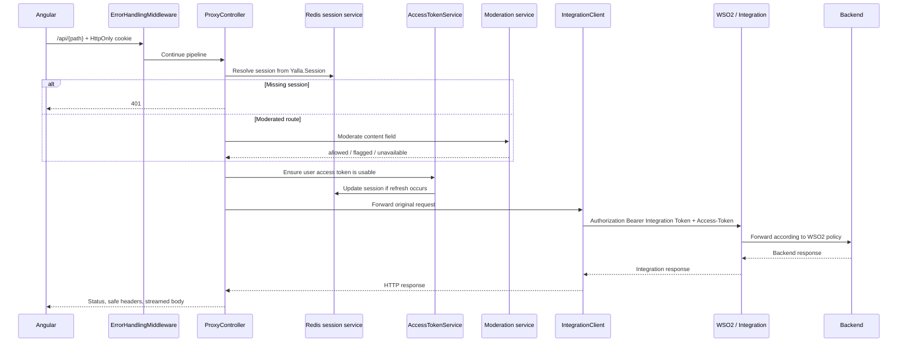

## 4. BFF endpoints

### BFF-owned endpoints

| Method | Route | Purpose | Special behavior |
| --- | --- | --- |
| POST | `/auth/login` | Authenticate through Integration `/api/Auth/login`. | Stores returned access/refresh tokens in Redis; returns only safe user data and sets cookie. |
| POST | `/auth/register` | Register through Integration `/api/Auth/register`. | Same server-side session creation as login. |
| POST | `/auth/logout` | End current session. | Uses Redis refresh token for downstream logout; treats downstream 401/404 as idempotent; clears session/cookie. |
| POST | `/auth/revoke` | Revoke current refresh token. | Requires BFF session; calls downstream revoke, then clears session/cookie. |
| GET | `/auth/me` | Read current session's safe profile. | Does not refresh access token. |
| GET | `/auth/google` | Start Google OIDC challenge. | Requires configured Google client credentials and HTTPS redirect URI. |
| GET | `/auth/google/callback` | Google OIDC callback. | **Handled by OpenID Connect middleware**, not `AuthController`. |
| GET | `/auth/google/complete` | Controller handoff after validated external identity. | Calls the configured external-login authentication route and creates the normal BFF session. |
| GET | `/health` | Liveness. | Runs no registered health checks. |
| GET | `/health/ready` | Redis readiness. | Executes the health check tagged `ready`. |
| GET/POST/PUT/PATCH/DELETE | `/api/{**path}` | Controlled application proxy. | Requires BFF session; selectively moderates four routes. |

### Generic proxy route

`ProxyController.Proxy` accepts `GET`, `POST`, `PUT`, `PATCH`, and `DELETE`. Its catch-all `path` is validated and is attached to the configured Integration host, ConnectHub API path, and `api/` prefix.

```mermaid
flowchart LR
    R[Incoming /api/{path}] --> S[Read BFF session]
    S --> T[Refresh user token if needed]
    T --> H[Create outbound request]
    H --> U[Integration host + ConnectHub path + /api/ + validated path + query]
    U --> X[Attach server-owned headers]
    X --> I[Integration Layer]
    I --> O[Copy status, allowed headers, body]
```

Example: `/api/Groups?skip=0` becomes:

```text
https://rescuer-copious-chef.ngrok-free.dev/ConnectHub/1.0.0/api/Groups?skip=0
```

### Forwarding rules

- The method is copied from the inbound request.
- Query string is preserved.
- A request body is forwarded as a stream when `ContentLength > 0`; its `Content-Type` is copied.
- Only `Accept`, `Accept-Language`, `If-Match`, `If-None-Match`, and `Range` are copied from client headers.
- Client `Authorization`, `Access-Token`, cookies, host overrides, and other non-allowlisted headers are not forwarded.
- The BFF always creates `Authorization: Bearer <integration-token>` from the shared Redis cache and `Access-Token` from the current Redis session.
- The upstream status code and body are forwarded. `Set-Cookie` and `Transfer-Encoding` are not copied back.
- Absolute URL fragments (`://`), blank paths, `.` and `..` path segments are rejected with `400` before an upstream destination is built.

## 5. Authentication, sessions, and authorization

The BFF does not generate application JWTs and does not validate a user JWT to authorize an action. It uses Redis session state to decide whether a browser has a BFF session. Backend authorization remains backend-owned after WSO2 forwarding.

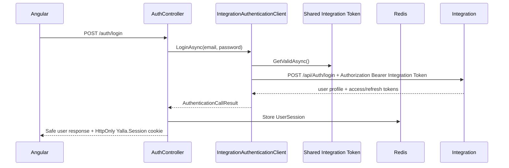

`UserSession` contains session/user profile fields, access token, refresh token, access-token expiry, optional refresh-token expiry, creation time, and session expiry. It is serialized under the Redis key prefix `yalla:bff:session:`. The cookie contains only a random 32-byte opaque session ID encoded as hexadecimal.

`AccessTokenService` decodes the JWT `exp` claim only for lifecycle timing. If missing, malformed, expired, or within `Authentication:AccessTokenExpirationSafetyMarginSeconds`, it uses a per-session `SemaphoreSlim` lock, re-reads Redis, and calls the configured refresh adapter. A failed refresh returns no session, which makes the proxy clear the session and return `401`.

### Authentication versus authorization

```text
Authentication: the BFF session identifies the browser as a session holder.
Authorization: the Backend decides whether the forwarded user token may perform a domain action.
```

## 6. Shared Integration Token

The Integration Token is not part of a user session. `IntegrationTokenService` caches it once under `yalla:bff:integration-token` and protects refresh/acquisition with a process-local static `SemaphoreSlim`.

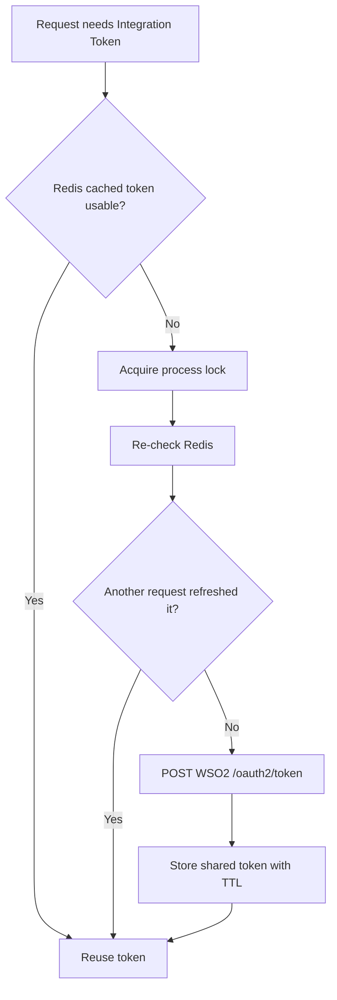

`Wso2IntegrationTokenClient` uses `grant_type=client_credentials` and HTTP Basic authentication with server-side `Integration:ClientId` and `Integration:ClientSecret`. It sends the request through the existing `IntegrationLayer` `HttpClient`; normal TLS validation remains enabled. The service prefers JWT `exp`; otherwise it can cache using `expires_in` minus the configured safety margin.

## 7. Content moderation

Moderation is synchronous and fail-closed. It happens **after a BFF session is found but before access-token refresh and before any Integration request**.

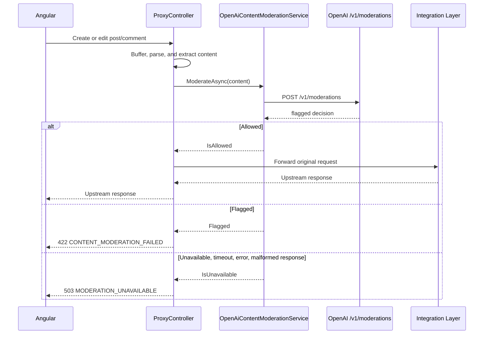

### Exact moderated routes

The matcher operates on the catch-all path after `/api/` and is case-insensitive.

| Operation | BFF route | Moderated? | Result when safe | Flagged | Moderation unavailable |
| --- | --- | ---: | --- | --- | --- |
| Create post | `POST /api/Posts/api/groups/{groupId}/posts` | Yes | Forward | `422` | `503` |
| Edit post | `PUT /api/Posts/api/posts/{id}` | Yes | Forward | `422` | `503` |
| Create comment | `POST /api/Comments/api/posts/{postId}/comments` | Yes | Forward | `422` | `503` |
| Edit comment | `PUT /api/Comments/api/comments/{id}` | Yes | Forward | `422` | `503` |
| All other proxy operations | Any other supported route | No | Normal proxy flow | N/A | N/A |

The controller enables request buffering, parses JSON, extracts exactly the `content` string, resets `Request.Body.Position` to zero, and then lets `IntegrationClient` stream the original body unchanged. Attachment IDs, parent comment IDs, group/post IDs, session IDs, and all tokens are not sent to OpenAI.

The exact user-facing responses are:

```json
{ "code": "CONTENT_MODERATION_FAILED", "message": "This content doesn’t meet our community guidelines. Please try something else." }
```

```json
{ "code": "MODERATION_UNAVAILABLE", "message": "We couldn’t check your content right now. Please try again in a moment." }
```

Malformed/missing/whitespace `content` on a moderated route is returned as `400` with `INVALID_CONTENT`. This is controller-level validation in the current implementation.

### OpenAI moderation service

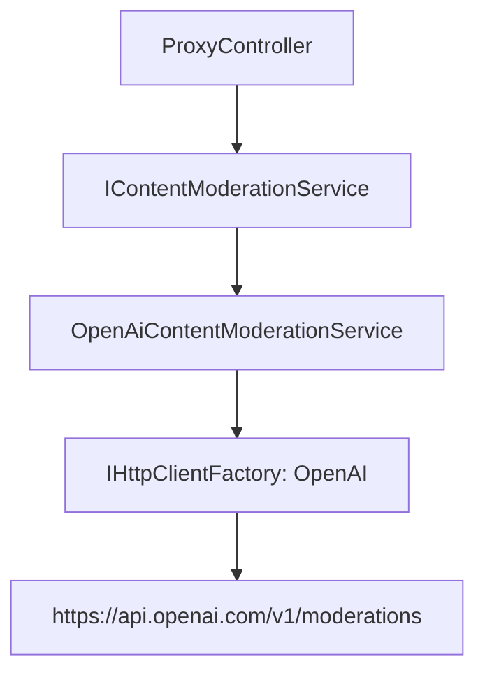

`OpenAiContentModerationService`:

- Uses the named `OpenAI` `HttpClient` with base URL `https://api.openai.com/v1/`.
- Sends `POST moderations` with `{ "model": configured model, "input": content }`.
- Adds the server-side `OpenAI:ApiKey` as a Bearer token.
- Treats non-success HTTP responses, timeouts, request failures, JSON failures, empty results, and missing/non-boolean `flagged` values as unavailable.
- Logs outcome/status metadata but not user content, API keys, or tokens.
- Does not retry automatically.

The configured default model is `omni-moderation-latest`. The model and timeout are non-secret configuration; the API key is expected through user secrets or production secret management.

## 8. HTTP clients and dependency registration

| Name / dependency | Lifetime or registration | Purpose |
| --- | --- | --- |
| `IntegrationLayer` HttpClient | Factory named client, 100-second timeout | Integration API, WSO2 token endpoint, and downstream auth routes. |
| `OpenAI` HttpClient | Factory named client, configured timeout | OpenAI moderation endpoint. |
| `IConnectionMultiplexer` | Singleton | Redis connection. |
| `ISessionStore` / `ISessionService` | Singleton | Redis session persistence and cookie operations. |
| `IAuthenticationClient` | Singleton | Login/register/external-login/refresh/revoke/logout Integration calls. |
| `IAccessTokenService` | Singleton | Access expiry and per-session refresh coordination. |
| `IIntegrationTokenStore` / `IIntegrationTokenClient` / `IIntegrationTokenService` | Singleton | Shared WSO2 Integration Token lifecycle. |
| `IIntegrationClient` | Singleton | Controlled API forwarding. |
| `IContentModerationService` | Singleton | OpenAI moderation boundary. |
| `IGoogleAuthenticationService` | Singleton | Google OIDC identity boundary. |

`Program.cs` registers controllers, OpenAPI in Development, cookie/OIDC authentication, CORS, health checks, the error middleware, and all services above. CORS uses configured origins with credentials and the methods `GET`, `POST`, `PUT`, `PATCH`, `DELETE`, and `OPTIONS`; it does not use `AllowAnyOrigin`.

## 9. Configuration and secrets

### Safe configuration committed to source

| Section | Current values / purpose |
| --- | --- |
| `Integration` | Shared host plus separate ConnectHub and token API paths, with a 30-second Integration Token safety margin. |
| `Authentication` | Development `Auth/*` paths, including `Auth/external-login`. |
| `Session` | Cookie name, 60-minute expiry, secure/same-site policy. |
| `Cors` | Development Angular origins `http://localhost:4200` and `https://localhost:4200`. |
| `Google` | Callback path, HTTPS redirect URI, and frontend redirect URI; no development client secret in JSON. |
| `OpenAI:Moderation` | `omni-moderation-latest` and 10-second timeout. |

### Secret configuration

Never commit these values:

```powershell
dotnet user-secrets set "Integration:ClientId" "<consumer-id>"
dotnet user-secrets set "Integration:ClientSecret" "<consumer-secret>"
dotnet user-secrets set "Google:ClientId" "<google-client-id>"
dotnet user-secrets set "Google:ClientSecret" "<google-client-secret>"
dotnet user-secrets set "OpenAI:ApiKey" "<openai-api-key>"
```

`Redis:ConnectionString` is currently present in Development configuration. **Needs Verification:** move it to user secrets/environment configuration before it contains credentials.

In non-Development environments, startup explicitly checks required Integration host/ConnectHub/token paths, client credentials, and login/register/external-login/refresh paths. It does not currently validate OpenAI or Google configuration at startup; those components return/use runtime configuration errors when invoked.

## 10. Error handling, logging, and health

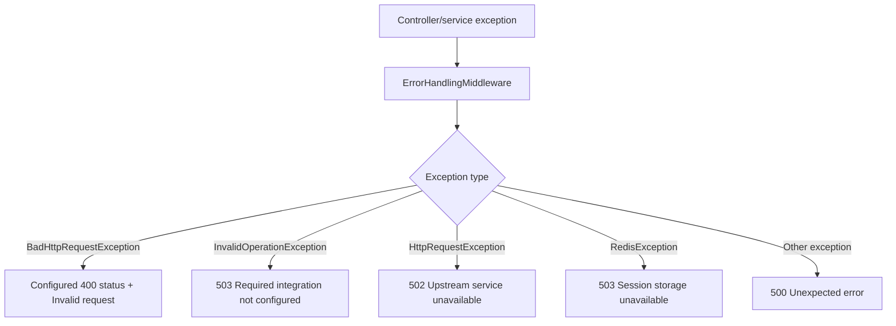

| Status | Current source of response |
| --- | --- |
| 400 | Invalid proxy path, malformed/missing moderated `content`, or mapped `BadHttpRequestException`. |
| 401 | Missing BFF session, failed access-token refresh, missing `/auth/revoke` session, Google remote failure. |
| 403 | Not generated directly by BFF logic; an upstream 403 is forwarded by the proxy. |
| 404 | Upstream 404 is forwarded; logout treats downstream 404 as idempotent. |
| 422 | Flagged moderated content. |
| 500 | Unhandled exception through centralized middleware. |
| 502 | `HttpRequestException` through centralized middleware. |
| 503 | Moderation unavailable, Redis error, or missing Integration configuration. |

The code logs route/path and status-class metadata. It does not intentionally log access tokens, refresh tokens, Integration Tokens, cookies, OpenAI API keys, or moderated content. The OpenAI service logs only allowed/flagged outcome and numeric service status. The Integration authentication client logs only that an auth response was incomplete.

`GET /health` is a liveness endpoint because its predicate runs no health checks. `GET /health/ready` executes `RedisHealthCheck`, which pings Redis and returns an unhealthy result without including connection details. OpenAI and Integration availability do not participate in readiness.

## 11. Google OIDC implementation

Google OIDC is implemented in the BFF. It uses the code response type, PKCE, state/correlation and nonce protections supplied by the OpenID Connect handler, HTTPS metadata, `openid email profile` scopes, and issuer/audience/lifetime token validation.

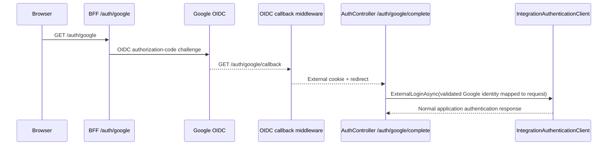

The configured redirect URI is validated to be HTTPS and to match `/auth/google/callback`. The OIDC handler overrides both authorization and token exchange redirect URI values with that configured URI. Google provider tokens are not saved (`SaveTokens = false`).

`GoogleAuthenticationService` extracts only the validated `sub`, `email`, `given_name`, `family_name`, and optional `picture` claims. `AuthController` maps them to the server-created external-login request; it does not accept those values from the browser. Google provider tokens are never stored in the BFF session or forwarded to the Integration Layer.

## 12. Security boundaries

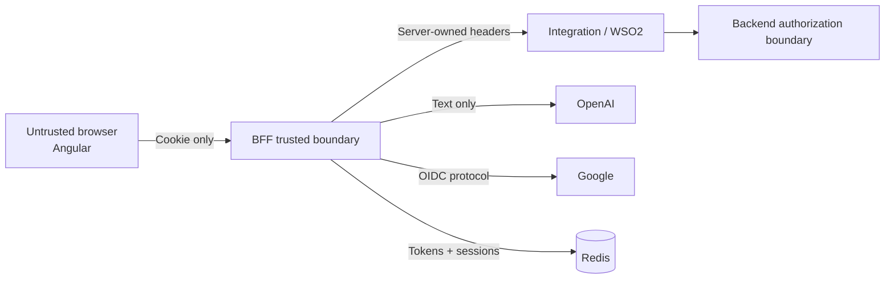

The BFF should not:

- access the backend database or create domain entities;
- duplicate group, post, comment, like, report, or notification business rules;
- let the browser select an arbitrary upstream host or forward client authentication headers;
- expose access, refresh, Integration, Google, or OpenAI credentials to the browser;
- bypass Integration/WSO2 when forwarding application API calls;
- publish a moderated write when no reliable moderation decision is available.

## 13. Complete flow examples

### Normal GET

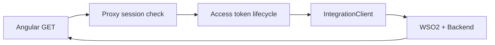

### Moderated write decision

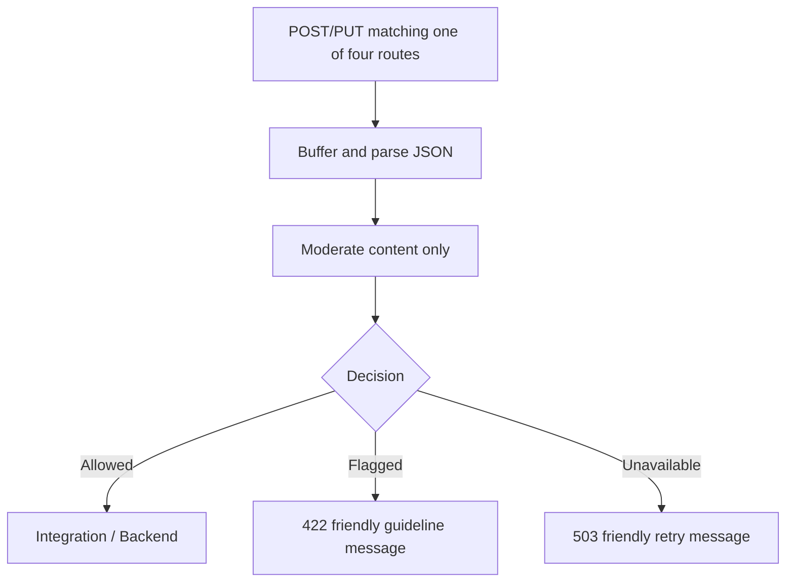

### Authentication request

`POST /auth/login` and `POST /auth/register` are implemented and call the Integration Layer. They first obtain the shared Integration Token; then the BFF stores returned application tokens only in Redis and sends a cookie/safe profile response to the browser.

## 14. Tests

`BFF.Tests` is an xUnit project targeting .NET 10. Source currently contains six tests:

| Test | Purpose |
| --- | --- |
| `GetValidAsync_ReusesCachedUnexpiredToken` | Valid shared Integration Token is reused. |
| `GetValidAsync_ReplacesExpiredToken` | Expired cached token is replaced. |
| `GetValidAsync_ConcurrentCallsAcquireOnlyOnce` | Twenty concurrent callers collapse to one acquisition. |
| `ModerateAsync_AllowsSafeContentAndSendsOnlySubmittedText` | Safe content is allowed; request payload is exactly model + submitted input. |
| `ModerateAsync_RejectsFlaggedContent` | Flagged response is rejected. |
| `ModerateAsync_FailsClosedWhenServiceIsUnavailableOrMalformed` | 429 and malformed response are unavailable, not safe. |

### Needs Verification

The source contains six tests, but the moderation tests were added after the latest successful command execution was blocked by the environment usage limit. Re-run `dotnet test BFF.slnx` before treating all six as verified. The last recorded successful run before those additions reported three Integration Token tests passing.

End-to-end verification still requires Redis, valid Integration/Google/OpenAI secrets, and an available Integration Layer.

## 15. Pending / Not Yet Implemented

- **OpenAPI warning:** the previous build output reported a transitive `Microsoft.OpenApi` 2.0.0 vulnerability advisory; it is not resolved in this project.
- **`BFF.http`:** references `http://localhost:5069/weatherforecast`, while the active launch settings use port `5000` and no WeatherForecast route exists. This file is stale. **Needs Verification.**
- **Distributed locking:** Integration Token and access-token refresh locking is process-local (`SemaphoreSlim`), not Redis/distributed. Multi-instance behavior is **Needs Verification**.
- **Production auth operation configuration:** base `appsettings.json` has no `Authentication:RevokePath` or `Authentication:LogoutPath`; production startup validation does not require them. Those endpoints need production configuration before use. **Needs Verification.**

## 16. How to read this BFF

```text
Understand request routing and moderation:
    → Controllers/ProxyController.cs

Understand browser authentication and safe session responses:
    → Controllers/AuthController.cs
    → Services/Sessions/

Understand Integration forwarding and token headers:
    → Services/Integration/IntegrationClient.cs
    → Services/Integration/IntegrationTokenService.cs

Understand OpenAI moderation:
    → Services/Moderation/IContentModerationService.cs
    → Services/Moderation/OpenAiContentModerationService.cs

Understand configuration and registration:
    → Configuration/BffOptions.cs
    → appsettings.json / appsettings.Development.json
    → Program.cs

Understand expected unit behavior:
    → BFF.Tests/
```

## Implementation Status

### Verified

- Source-level controller, session, Integration Token, proxy, moderation, OpenID Connect, CORS, error-middleware, and health-check wiring documented above.
- A prior isolated build succeeded before the moderation test additions.
- A prior test run passed the three Integration Token tests.

### Pending

- Google-to-Yalla Integration account mapping contract and implementation.
- Operational end-to-end testing with Integration Layer, Redis, OpenAI credentials, and Google credentials.

### Needs Verification

- Compile and run all six current tests after command execution access is restored.
- Multi-instance token/refresh lock behavior.
- Stale `BFF.http` sample request and production revoke/logout configuration.
