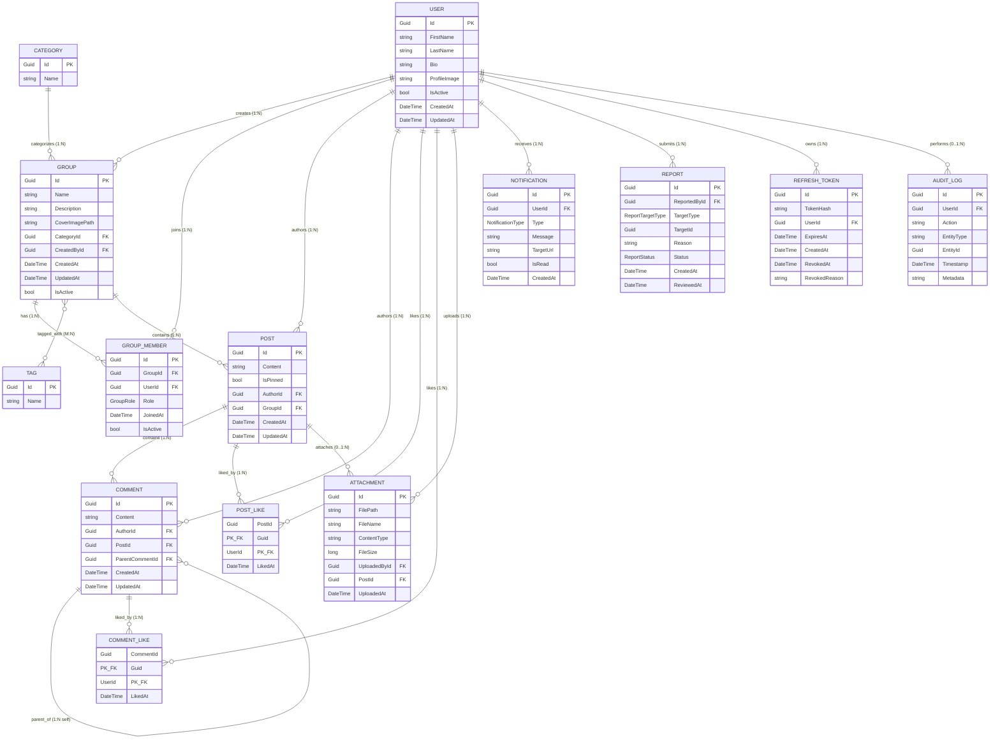

# ConnectHub Database Schema

## 1. Database Overview

ConnectHub is a social collaboration platform designed to foster internal organization communities around shared interests (e.g., technology, sports, hobbies). The backend is architected as an N-Tier ASP.NET Core Web API with Entity Framework Core for persistence against a relational database (SQL Server).

This document serves as the complete, authoritative reference for the **`ConnectHub.Models`** domain and database schema. It describes every entity, scalar attribute, foreign key, navigation property, relationship cardinality, and associated enum.

### Key Architectural Characteristics
* **Universal Identifier Strategy:** All entity primary keys and foreign keys standardize on `Guid` (`uniqueidentifier`) for distributed ID generation and uniform routing.
* **Separation of Concerns:** The `User` domain model captures application profile and collaboration metadata. Core authentication concerns (passwords, logins, security tokens) are managed by ASP.NET Core Identity (`ApplicationUser`) in the persistence/infrastructure layer, maintaining a clean 1:1 conceptual mapping via `User.Id`.
* **File Storage Policy:** Binary files (profile images, group cover pictures, post attachments) are stored on the server file system or object store. The database stores strictly relative file paths (`string`) and metadata.
* **Polymorphic Reporting:** The `Report` entity uses a discriminator pattern (`TargetType` + `TargetId`) allowing uniform moderation workflows across both `Post` and `Comment` entities.

### Entity Overview Table

| Entity | Purpose |
| :--- | :--- |
| **User** | Represents the business and collaboration profile of a platform user. |
| **Category** | Represents a top-level classification for community groups (e.g., Sports, Tech). |
| **Tag** | Represents descriptive keywords used for group discovery and many-to-many filtering. |
| **Group** | Represents an interest-based community containing members, discussions, and posts. |
| **GroupMember** | Represents explicit user membership and role assignments within a group. |
| **Post** | Represents a primary feed entry published within a group. |
| **PostLike** | Join entity tracking user likes on posts (composite primary key). |
| **Comment** | Represents top-level comments and nested replies on posts (threaded hierarchy). |
| **CommentLike** | Join entity tracking user likes on comments (composite primary key). |
| **Attachment** | Represents uploaded files/media associated with posts. |
| **Notification** | Represents in-app activity notifications targeted at specific users. |
| **Report** | Represents user-submitted moderation reports on posts or comments. |
| **RefreshToken** | Represents persisted hashed refresh tokens for secure JWT token rotation and revocation. |
| **AuditLog** | Represents historical security and business audit records. |

---

## 2. Complete ERD

---

## 3. Entity Overview

The schema is structured into five functional areas:

1. **Identity & User Profiles:** `User` stores application-level profile data decoupled from low-level authentication.
2. **Communities & Membership:** `Category`, `Tag`, `Group`, and `GroupMember` manage group hierarchies, discovery keywords, and role-based permissions (Owner, Admin, Member).
3. **Content Feed:** `Post`, `Attachment`, and `Comment` store user-generated text, rich attachments, and threaded replies.
4. **Interactions:** `PostLike` and `CommentLike` record distinct social engagements using composite keys.
5. **Platform Governance & Alerts:** `Notification` provides targeted event delivery, while `Report` powers content moderation across posts and comments.

---

## 4. Entity Details

### 4.1 User

#### Purpose
Represents a platform member's business profile within ConnectHub. It maintains profile attributes, account status, and serves as the primary foreign entity for created groups, authored posts, comments, likes, notifications, and uploaded attachments.

#### Attributes Table

| Attribute | Type | Nullable | Key | Database Role | What does it represent? |
| :--- | :--- | :--- | :--- | :--- | :--- |
| `Id` | `Guid` | No | PK | Primary Key | Unique identifier of the user profile, matching the Identity user ID. |
| `FirstName` | `string` | No | — | Scalar Column | The user's given/first name. |
| `LastName` | `string` | No | — | Scalar Column | The user's family/last name. |
| `Bio` | `string?` | Yes | — | Scalar Column | Optional self-description or biography. |
| `ProfileImagePath` | `string?` | Yes | — | Scalar Column | Provider-neutral profile-image value: a relative local-storage path or an external HTTPS URL. |
| `IsActive` | `bool` | No | — | Scalar Column | Flag indicating if the user account is active. |
| `CreatedAt` | `DateTime` | No | — | Audit Column | UTC timestamp when the user profile was created. |
| `UpdatedAt` | `DateTime?` | Yes | — | Audit Column | UTC timestamp when the profile was last modified. |
| `CreatedGroups` | `ICollection<Group>` | No | — | Collection Nav | Groups founded/created by this user. |
| `GroupMemberships` | `ICollection<GroupMember>` | No | — | Collection Nav | Group memberships held by this user. |
| `Posts` | `ICollection<Post>` | No | — | Collection Nav | Posts authored by this user. |
| `Notifications` | `ICollection<Notification>` | No | — | Collection Nav | Notifications dispatched to this user. |

#### Attribute Deep Dive
1. **`Id`:** Unique identifier. Serves as the primary key and maps 1:1 with ASP.NET Core Identity (`ApplicationUser.Id`). Required.
2. **`FirstName` / `LastName`:** User's personal names. Required for display throughout UI/feed.
3. **`Bio`:** Short biography. Optional (`string?`).
4. **`ProfileImagePath`:** The existing database column backs `User.ProfileImage`. Local users store a relative path such as `uploads/profile-images/{UserGuid}/profile.jpg`; external users store their provider's HTTPS image URL directly.
5. **`IsActive`:** Soft-state flag. If `false`, user interactions are disabled.
6. **`CreatedAt` / `UpdatedAt`:** Temporal audit metadata. `CreatedAt` is immutable; `UpdatedAt` is updated on profile changes.
7. **`CreatedGroups`:** One-to-many navigation referencing all `Group` records where `CreatedById == User.Id`.
8. **`GroupMemberships`:** One-to-many navigation referencing `GroupMember` records where `UserId == User.Id`.
9. **`Posts`:** One-to-many navigation referencing all `Post` records where `AuthorId == User.Id`.
10. **`Notifications`:** One-to-many navigation referencing all alerts delivered to this user where `UserId == User.Id`.

---

### 4.2 Category

#### Purpose
Represents an application-managed topic classification (for example, "Technology", "Sports", or "General") under which community groups are organized. Categories are dynamic data: authenticated users can create them through the API; they are not predefined or seeded reference data.

#### Attributes Table

| Attribute | Type | Nullable | Key | Database Role | What does it represent? |
| :--- | :--- | :--- | :--- | :--- | :--- |
| `Id` | `Guid` | No | PK | Primary Key | Unique identifier of the category. |
| `Name` | `string` | No | — | Scalar Column | The unique display name of the category. |
| `Groups` | `ICollection<Group>` | No | — | Collection Nav | All community groups classified under this category. |

#### Attribute Deep Dive
1. **`Id`:** Primary key identifier. Required.
2. **`Name`:** Name of the category. Required and unique in business context (e.g., "Engineering").
3. **`Groups`:** One-to-many navigation property exposing all `Group` instances assigned to this category (`Group.CategoryId == Category.Id`).

---

### 4.3 Tag

#### Purpose
Represents flexible, reusable keyword tags (e.g., "CSharp", "DotNet", "Football") associated with groups to enable faceted search and discovery.

#### Attributes Table

| Attribute | Type | Nullable | Key | Database Role | What does it represent? |
| :--- | :--- | :--- | :--- | :--- | :--- |
| `Id` | `Guid` | No | PK | Primary Key | Unique identifier of the tag. |
| `Name` | `string` | No | — | Scalar Column | Unique display text of the tag. |
| `Groups` | `ICollection<Group>` | No | — | Collection Nav | Community groups associated with this tag. |

#### Attribute Deep Dive
1. **`Id`:** Primary key identifier. Required.
2. **`Name`:** Label of the tag. Required and unique.
3. **`Groups`:** Many-to-many navigation collection linked to `Group.Tags`. Managed via an EF Core join table (`GroupTags`).

---

### 4.4 Group

#### Purpose
Represents an interest group or community. It is the central container for members, posts, tags, and group-level permission administration.

#### Attributes Table

| Attribute | Type | Nullable | Key | Database Role | What does it represent? |
| :--- | :--- | :--- | :--- | :--- | :--- |
| `Id` | `Guid` | No | PK | Primary Key | Unique identifier of the community group. |
| `Name` | `string` | No | — | Scalar Column | Display name of the group. |
| `Description` | `string?` | Yes | — | Scalar Column | Purpose and summary description of the group. |
| `CoverImagePath` | `string?` | Yes | — | Scalar Column | Relative server path to the group's cover image banner. |
| `CategoryId` | `Guid` | No | FK | Foreign Key | References `Category.Id`. |
| `CreatedById` | `Guid` | No | FK | Foreign Key | References `User.Id` (the creator/owner). |
| `CreatedAt` | `DateTime` | No | — | Audit Column | UTC timestamp when the group was created. |
| `UpdatedAt` | `DateTime?` | Yes | — | Audit Column | UTC timestamp when group metadata was last updated. |
| `IsActive` | `bool` | No | — | Scalar Column | Status flag (soft deletion / archive state). |
| `CreatedBy` | `User` | No | Navigation | Reference Nav | Object navigation to the creator `User` record. |
| `Category` | `Category` | No | Navigation | Reference Nav | Object navigation to the assigned `Category` record. |
| `Members` | `ICollection<GroupMember>` | No | — | Collection Nav | Active and historic membership records for the group. |
| `Tags` | `ICollection<Tag>` | No | — | Collection Nav | Tags assigned to the group for search/filtering. |
| `Posts` | `ICollection<Post>` | No | — | Collection Nav | Feed posts published within this group. |

#### Attribute Deep Dive
1. **`Id`:** Primary key. Required.
2. **`Name`:** Group name (3–100 characters). Required.
3. **`Description`:** Summary of the group's charter (up to 1,000 characters). Optional.
4. **`CoverImagePath`:** Relative storage path for the banner image. Optional.
5. **`CategoryId` / `Category`:** Foreign key and navigation property establishing that every group belongs to exactly one `Category`. Required.
6. **`CreatedById` / `CreatedBy`:** Foreign key and navigation property pointing to the founding `User`. Required.
7. **`CreatedAt` / `UpdatedAt`:** Audit timestamps.
8. **`IsActive`:** Soft-delete indicator. If `false`, the group is hidden from browse queries.
9. **`Members`:** One-to-many collection containing all `GroupMember` records.
10. **`Tags`:** Many-to-many collection mapped to `Tag` entities.
11. **`Posts`:** One-to-many collection of all discussions and announcements in this group.

---

### 4.5 GroupMember

#### Purpose
Represents an individual user's explicit membership and role within a group. It controls access rights (Owner, Admin, Member) for group-scoped actions.

#### Attributes Table

| Attribute | Type | Nullable | Key | Database Role | What does it represent? |
| :--- | :--- | :--- | :--- | :--- | :--- |
| `Id` | `Guid` | No | PK | Primary Key | Unique identifier of the membership record. |
| `GroupId` | `Guid` | No | FK | Foreign Key | References `Group.Id`. |
| `UserId` | `Guid` | No | FK | Foreign Key | References `User.Id`. |
| `Role` | `GroupRole` | No | — | Enum Column | The member's permission level (Member, Admin, Owner). |
| `JoinedAt` | `DateTime` | No | — | Audit Column | UTC timestamp when the user joined the group. |
| `IsActive` | `bool` | No | — | Scalar Column | Flag indicating if membership is active or left/removed. |
| `Group` | `Group` | No | Navigation | Reference Nav | Navigation to the associated `Group`. |
| `User` | `User` | No | Navigation | Reference Nav | Navigation to the member `User`. |

#### Attribute Deep Dive
1. **`Id`:** Primary key. Required.
2. **`GroupId` / `Group`:** Identifies the group. Required FK.
3. **`UserId` / `User`:** Identifies the member user. Required FK.
   * *Constraint:* `(GroupId, UserId)` must be unique in the database.
4. **`Role`:** Enum specifying authorization capabilities within the group context:
   * `Member (1)`: Can view feed, create posts, write comments, like, and report content.
   * `Admin (2)`: Can pin posts, delete any content, change member roles, remove members.
   * `Owner (3)`: Full control, including updating/deleting the group.
5. **`JoinedAt`:** Timestamp of joining.
6. **`IsActive`:** Soft-delete flag. Retains history when a user leaves or is kicked.

---

### 4.6 Post

#### Purpose
Represents a content post published by a member within a group feed. Posts hold rich text, optional attachments, likes, and comment threads.

#### Attributes Table

| Attribute | Type | Nullable | Key | Database Role | What does it represent? |
| :--- | :--- | :--- | :--- | :--- | :--- |
| `Id` | `Guid` | No | PK | Primary Key | Unique identifier of the post. |
| `Content` | `string` | No | — | Scalar Column | Text content of the post (1–10,000 characters). |
| `IsPinned` | `bool` | No | — | Scalar Column | Indicates if the post is pinned at the top of the feed. |
| `AuthorId` | `Guid` | No | FK | Foreign Key | References `User.Id` (the author). |
| `GroupId` | `Guid` | No | FK | Foreign Key | References `Group.Id` (the host group). |
| `CreatedAt` | `DateTime` | No | — | Audit Column | UTC timestamp when the post was created. |
| `UpdatedAt` | `DateTime?` | Yes | — | Audit Column | UTC timestamp when the post was edited. |
| `Author` | `User` | No | Navigation | Reference Nav | Navigation to the author `User`. |
| `Group` | `Group` | No | Navigation | Reference Nav | Navigation to the parent `Group`. |
| `Comments` | `ICollection<Comment>` | No | — | Collection Nav | Comments and replies on this post. |
| `Likes` | `ICollection<PostLike>` | No | — | Collection Nav | Like records associated with this post. |
| `Attachments` | `ICollection<Attachment>` | No | — | Collection Nav | Media attachments uploaded for this post. |

#### Attribute Deep Dive
1. **`Id`:** Primary key. Required.
2. **`Content`:** Main body text of the post. Required.
3. **`IsPinned`:** Pin flag toggled by group Admins or Owners to stick critical announcements at the top of the feed.
4. **`AuthorId` / `Author`:** References the authoring user. Required FK.
5. **`GroupId` / `Group`:** References the community group hosting the post. Required FK.
6. **`CreatedAt` / `UpdatedAt`:** Audit dates for post creation and subsequent author edits.
7. **`Comments`:** One-to-many collection linking all `Comment` records on this post.
8. **`Likes`:** One-to-many collection referencing `PostLike` join records.
9. **`Attachments`:** One-to-many collection referencing files linked to this post.

---

### 4.7 PostLike

#### Purpose
Explicit join entity recording a user's "like" reaction on a specific `Post`. It uses a composite primary key `(PostId, UserId)` to guarantee at the database level that a user can like a post only once.

#### Attributes Table

| Attribute | Type | Nullable | Key | Database Role | What does it represent? |
| :--- | :--- | :--- | :--- | :--- | :--- |
| `PostId` | `Guid` | No | PK, FK | Composite PK / FK | References `Post.Id`. |
| `UserId` | `Guid` | No | PK, FK | Composite PK / FK | References `User.Id`. |
| `LikedAt` | `DateTime` | No | — | Audit Column | UTC timestamp when the like was placed. |
| `Post` | `Post` | No | Navigation | Reference Nav | Navigation to the liked `Post`. |
| `User` | `User` | No | Navigation | Reference Nav | Navigation to the reactor `User`. |

#### Attribute Deep Dive
1. **`PostId` / `Post`:** Foreign key to the liked post. Forms part of the composite primary key.
2. **`UserId` / `User`:** Foreign key to the liking user. Forms part of the composite primary key.
3. **`LikedAt`:** Audit timestamp.
* *Note:* Attempting to insert a duplicate `(PostId, UserId)` causes a database primary key violation, corresponding to HTTP `409 Conflict`.

---

### 4.8 Comment

#### Purpose
Represents a text comment or threaded reply on a post. Supports self-referential nesting via `ParentCommentId`.

#### Attributes Table

| Attribute | Type | Nullable | Key | Database Role | What does it represent? |
| :--- | :--- | :--- | :--- | :--- | :--- |
| `Id` | `Guid` | No | PK | Primary Key | Unique identifier of the comment. |
| `Content` | `string` | No | — | Scalar Column | Text content of the comment (1–2,000 characters). |
| `AuthorId` | `Guid` | No | FK | Foreign Key | References `User.Id` (the author). |
| `PostId` | `Guid` | No | FK | Foreign Key | References `Post.Id`. |
| `ParentCommentId` | `Guid?` | Yes | FK | Foreign Key | Self-referencing FK to `Comment.Id` for replies. |
| `CreatedAt` | `DateTime` | No | — | Audit Column | UTC timestamp when the comment was created. |
| `UpdatedAt` | `DateTime?` | Yes | — | Audit Column | UTC timestamp when the comment was last edited. |
| `Author` | `User` | No | Navigation | Reference Nav | Navigation to the author `User`. |
| `Post` | `Post` | No | Navigation | Reference Nav | Navigation to the parent `Post`. |
| `ParentComment` | `Comment?` | Yes | Navigation | Reference Nav | Navigation to the parent comment (null if top-level). |
| `Replies` | `ICollection<Comment>` | No | — | Collection Nav | Nested direct replies to this comment. |
| `Likes` | `ICollection<CommentLike>` | No | — | Collection Nav | Like records associated with this comment. |

#### Attribute Deep Dive
1. **`Id`:** Primary key. Required.
2. **`Content`:** Comment message text. Required.
3. **`AuthorId` / `Author`:** Author of the comment. Required FK.
4. **`PostId` / `Post`:** Parent post being discussed. Required FK.
5. **`ParentCommentId` / `ParentComment`:** Self-referential nullable foreign key.
   * `null`: Top-level comment directly under the post.
   * `Guid`: Nested reply to the specified parent comment.
6. **`CreatedAt` / `UpdatedAt`:** Audit timestamps.
7. **`Replies`:** One-to-many collection containing child `Comment` entities where `ParentCommentId == this.Id`.
8. **`Likes`:** One-to-many collection referencing `CommentLike` records.

---

### 4.9 CommentLike

#### Purpose
Explicit join entity recording a user's "like" on a `Comment`. Uses a composite primary key `(CommentId, UserId)`.

#### Attributes Table

| Attribute | Type | Nullable | Key | Database Role | What does it represent? |
| :--- | :--- | :--- | :--- | :--- | :--- |
| `CommentId` | `Guid` | No | PK, FK | Composite PK / FK | References `Comment.Id`. |
| `UserId` | `Guid` | No | PK, FK | Composite PK / FK | References `User.Id`. |
| `LikedAt` | `DateTime` | No | — | Audit Column | UTC timestamp when the like was placed. |
| `Comment` | `Comment` | No | Navigation | Reference Nav | Navigation to the liked `Comment`. |
| `User` | `User` | No | Navigation | Reference Nav | Navigation to the reactor `User`. |

#### Attribute Deep Dive
1. **`CommentId` / `Comment`:** Foreign key to the liked comment. Forms part of the composite primary key.
2. **`UserId` / `User`:** Foreign key to the liking user. Forms part of the composite primary key.
3. **`LikedAt`:** Audit timestamp.

---

### 4.10 Attachment

#### Purpose
Represents a file uploaded to the server (image, document, PDF) and optionally attached to a `Post`.

#### Attributes Table

| Attribute | Type | Nullable | Key | Database Role | What does it represent? |
| :--- | :--- | :--- | :--- | :--- | :--- |
| `Id` | `Guid` | No | PK | Primary Key | Unique identifier of the uploaded attachment. |
| `FilePath` | `string` | No | — | Scalar Column | Relative server path where the file is stored. |
| `FileName` | `string` | No | — | Scalar Column | Original client filename at upload time. |
| `ContentType` | `string` | No | — | Scalar Column | MIME type (e.g. `image/png`, `application/pdf`). |
| `FileSize` | `long` | No | — | Scalar Column | Size of the file in bytes. |
| `UploadedById` | `Guid` | No | FK | Foreign Key | References `User.Id` (uploader). |
| `PostId` | `Guid?` | Yes | FK | Foreign Key | References `Post.Id` (null prior to post association). |
| `UploadedAt` | `DateTime` | No | — | Audit Column | UTC timestamp when the file was uploaded. |
| `UploadedBy` | `User` | No | Navigation | Reference Nav | Navigation to the uploading `User`. |
| `Post` | `Post?` | Yes | Navigation | Reference Nav | Navigation to the linked `Post` (if attached). |

#### Attribute Deep Dive
1. **`Id`:** Primary key. Required.
2. **`FilePath`:** Server storage path (e.g., `/uploads/attachments/post-doc-1.pdf`).
3. **`FileName`:** Original file name preserved for client download headers.
4. **`ContentType`:** MIME type for validation and proper HTTP `Content-Type` headers upon retrieval.
5. **`FileSize`:** Size in bytes for quota enforcement and client display.
6. **`UploadedById` / `UploadedBy`:** Uploader audit reference. Required FK.
7. **`PostId` / `Post`:** Nullable foreign key.
   * *Workflow:* Files are uploaded first via `/api/attachments` (`PostId = null`). When `POST /api/groups/{id}/posts` is called with the attachment IDs, `PostId` is updated to link the file.
8. **`UploadedAt`:** Audit timestamp.

---

### 4.11 Notification

#### Purpose
Represents an asynchronous alert delivered to an individual user regarding interactions that affect them (e.g., new replies, comments, likes, role changes).

#### Attributes Table

| Attribute | Type | Nullable | Key | Database Role | What does it represent? |
| :--- | :--- | :--- | :--- | :--- | :--- |
| `Id` | `Guid` | No | PK | Primary Key | Unique identifier of the notification. |
| `UserId` | `Guid` | No | FK | Foreign Key | References `User.Id` (the recipient). |
| `Type` | `NotificationType` | No | — | Enum Column | The category of event that caused the notification. |
| `Message` | `string` | No | — | Scalar Column | Human-readable notification text. |
| `TargetUrl` | `string?` | Yes | — | Scalar Column | Optional deep-link URL to navigate to the subject entity. |
| `IsRead` | `bool` | No | — | Scalar Column | Read status flag for badge counts. |
| `CreatedAt` | `DateTime` | No | — | Audit Column | UTC timestamp when the notification was created. |
| `User` | `User` | No | Navigation | Reference Nav | Navigation to the recipient `User`. |

#### Attribute Deep Dive
1. **`Id`:** Primary key. Required.
2. **`UserId` / `User`:** Target user receiving the alert. Required FK.
3. **`Type`:** Classified by `NotificationType` enum:
   * `NewPost (1)`: New post published in a joined group.
   * `NewComment (2)`: New comment on a post authored by the user.
   * `NewReply (3)`: Reply to the user's comment.
   * `PostLiked (4)`: User's post was liked.
   * `CommentLiked (5)`: User's comment was liked.
   * `MemberJoined (6)`: New member joined an owned/administered group.
   * `RoleChanged (7)`: User's group role was modified.
4. **`Message`:** Formatted string (e.g., "John Doe commented on your post.").
5. **`TargetUrl`:** Client route for in-app navigation (e.g., `/groups/123/posts/456`).
6. **`IsRead`:** Boolean flag (`false` by default) used to calculate unread badge counters.
7. **`CreatedAt`:** UTC timestamp.

---

### 4.12 Report

#### Purpose
Represents a user-submitted flag reporting abusive, offensive, or policy-violating content. Uses a polymorphic target reference to support both posts and comments under a single review workflow.

#### Attributes Table

| Attribute | Type | Nullable | Key | Database Role | What does it represent? |
| :--- | :--- | :--- | :--- | :--- | :--- |
| `Id` | `Guid` | No | PK | Primary Key | Unique identifier of the report record. |
| `ReportedById` | `Guid` | No | FK | Foreign Key | References `User.Id` (the reporting user). |
| `TargetType` | `ReportTargetType` | No | — | Enum Column | Identifies whether the reported item is a Post or Comment. |
| `TargetId` | `Guid` | No | — | Discriminator ID | The `Id` of the reported `Post` or `Comment`. |
| `Reason` | `string` | No | — | Scalar Column | Description of the violation provided by the reporter. |
| `Status` | `ReportStatus` | No | — | Enum Column | Current moderation state (Pending, ActionTaken, Dismissed). |
| `CreatedAt` | `DateTime` | No | — | Audit Column | UTC timestamp when the report was submitted. |
| `ReviewedAt` | `DateTime?` | Yes | — | Audit Column | UTC timestamp when a moderator processed the report. |
| `ReportedBy` | `User` | No | Navigation | Reference Nav | Navigation to the reporting `User`. |

#### Attribute Deep Dive
1. **`Id`:** Primary key. Required.
2. **`ReportedById` / `ReportedBy`:** User who submitted the report. Required FK.
3. **`TargetType`:** Enum discriminating content type:
   * `Post (1)`: Target is a `Post`.
   * `Comment (2)`: Target is a `Comment`.
4. **`TargetId`:** Holds the primary key value (`Guid`) of the reported entity based on `TargetType`.
5. **`Reason`:** User's explanation (10–500 characters). Required.
6. **`Status`:** Current workflow state:
   * `Pending (1)`: Awaiting review.
   * `ActionTaken (2)`: Content removed or author warned/banned.
   * `Dismissed (3)`: Deemed acceptable by moderator.
7. **`CreatedAt` / `ReviewedAt`:** Audit timeline. `ReviewedAt` is set when status moves from `Pending`.

---

### 4.13 RefreshToken

#### Purpose
Represents a cryptographically secure, persisted refresh token used for JWT access-token rotation and revocation. The raw token string is never persisted; only its SHA-256 hash is stored in `TokenHash`.

#### Attributes Table

| Attribute | Type | Nullable | Key | Database Role | What does it represent? |
| :--- | :--- | :--- | :--- | :--- | :--- |
| `Id` | `Guid` | No | PK | Primary Key | Unique identifier of the refresh token record. |
| `TokenHash` | `string` | No | — | Scalar / Unique Index | SHA-256 hash of the 64-byte random refresh token. |
| `UserId` | `Guid` | No | FK | Foreign Key | References `User.Id` (the token owner). |
| `ExpiresAt` | `DateTime` | No | — | Expiration Column | UTC timestamp when the refresh token expires. |
| `CreatedAt` | `DateTime` | No | — | Audit Column | UTC timestamp when the refresh token was issued. |
| `RevokedAt` | `DateTime?` | Yes | — | Revocation Column | UTC timestamp when revoked (logout, rotation, or reuse detection). |
| `RevokedReason` | `string?` | Yes | — | Scalar Column | Reason for revocation (e.g. "Rotated", "Logged out"). |
| `User` | `User` | No | Navigation | Reference Nav | Navigation to the owning `User`. |

#### Attribute Deep Dive
1. **`Id`:** Primary key. Required.
2. **`TokenHash`:** SHA-256 hash string (512 max length) with a unique index. Ensures fast lookup and prevents raw token leakage if the database is compromised.
3. **`UserId` / `User`:** Foreign key linking to the domain user. Cascade delete enabled.
4. **`ExpiresAt`:** Expiration timestamp (e.g. 7 days from creation).
5. **`RevokedAt` / `RevokedReason`:** Nullable revocation timestamp and explanation. If set, the token cannot be used. If a revoked token is attempted to be reused, all active tokens for that user are revoked immediately for security.

---

### 4.14 AuditLog

#### Purpose
Records significant security and operational business events (user registration, logins, logouts, token rotation/revocation, group creation/deletion, content moderation).

#### Attributes Table

| Attribute | Type | Nullable | Key | Database Role | What does it represent? |
| :--- | :--- | :--- | :--- | :--- | :--- |
| `Id` | `Guid` | No | PK | Primary Key | Unique identifier of the audit entry. |
| `UserId` | `Guid?` | Yes | FK | Foreign Key | References `User.Id` (acting user, null for system tasks). |
| `Action` | `string` | No | — | Scalar Column | Name of the action (e.g. "Login", "Register", "CreateGroup"). |
| `EntityType` | `string` | No | — | Scalar Column | The entity type affected (e.g. "User", "Group", "Post"). |
| `EntityId` | `Guid?` | Yes | — | Scalar Column | The primary key ID of the affected entity. |
| `Timestamp` | `DateTime` | No | — | Audit Column | UTC timestamp when the action occurred. |
| `Metadata` | `string?` | Yes | — | Scalar Column | Additional non-sensitive context/payload in JSON format. |
| `User` | `User?` | Yes | Navigation | Reference Nav | Navigation to the acting `User` record. |

#### Attribute Deep Dive
1. **`Id`:** Primary key. Required.
2. **`UserId` / `User`:** Acting user ID. Nullable to permit system actions. Uses `SetNull` on user deletion to preserve historical logs.
3. **`Action` / `EntityType` / `EntityId`:** Categorizes the event for security auditing.
4. **`Timestamp`:** UTC timestamp of the event.
5. **`Metadata`:** Optional JSON string for extra contextual metadata. **Never contains sensitive credentials, raw passwords, or tokens.**

---

## 5. Relationships

| Relationship | Cardinality | Foreign Key | Business Meaning |
| :--- | :--- | :--- | :--- |
| **Category → Group** | One-to-Many (1:N) | `Group.CategoryId` | Every group belongs to exactly one category; a category classifies multiple groups. |
| **User → Group (CreatedBy)** | One-to-Many (1:N) | `Group.CreatedById` | A user can create/own multiple groups; each group has one creator/owner. |
| **Group → GroupMember** | One-to-Many (1:N) | `GroupMember.GroupId` | A group has multiple member records; each membership belongs to one group. |
| **User → GroupMember** | One-to-Many (1:N) | `GroupMember.UserId` | A user can join multiple groups; each membership represents one user in that group. |
| **Group ↔ Tag** | Many-to-Many (M:N) | EF Join Table (`GroupTags`) | A group can have multiple tags; a tag can classify multiple groups. |
| **Group → Post** | One-to-Many (1:N) | `Post.GroupId` | A group contains multiple feed posts; each post belongs to a specific group. |
| **User → Post (Author)** | One-to-Many (1:N) | `Post.AuthorId` | A user can author multiple posts; each post has one author. |
| **Post → Comment** | One-to-Many (1:N) | `Comment.PostId` | A post has a discussion thread of multiple comments; each comment belongs to one post. |
| **User → Comment (Author)** | One-to-Many (1:N) | `Comment.AuthorId` | A user can write multiple comments; each comment has one author. |
| **Comment → Comment (Replies)** | One-to-Many (1:N Self) | `Comment.ParentCommentId` | A comment can have multiple replies; a reply belongs to one parent comment. |
| **Post → PostLike** | One-to-Many (1:N) | `PostLike.PostId` | A post receives likes from multiple users; each like record references one post. |
| **User → PostLike** | One-to-Many (1:N) | `PostLike.UserId` | A user can like multiple posts; unique per `(PostId, UserId)`. |
| **Comment → CommentLike** | One-to-Many (1:N) | `CommentLike.CommentId` | A comment receives likes from multiple users; each like references one comment. |
| **User → CommentLike** | One-to-Many (1:N) | `CommentLike.UserId` | A user can like multiple comments; unique per `(CommentId, UserId)`. |
| **User → Attachment** | One-to-Many (1:N) | `Attachment.UploadedById` | A user can upload multiple files; each attachment has one uploader. |
| **Post → Attachment** | Zero/One-to-Many (0..1:N) | `Attachment.PostId` | A post can contain multiple file attachments; an attachment can be unattached initially. |
| **User → Notification** | One-to-Many (1:N) | `Notification.UserId` | A user receives multiple notifications; each notification is addressed to one user. |
| **User → Report** | One-to-Many (1:N) | `Report.ReportedById` | A user can submit multiple moderation reports; each report is filed by one user. |

---

## 6. Foreign Key Map

| Dependent Entity | Foreign Key Column | Referenced Entity | Referenced Column | Nullable | Business Purpose |
| :--- | :--- | :--- | :--- | :--- | :--- |
| `Group` | `CategoryId` | `Category` | `Id` | No | Assigns group to a required category. |
| `Group` | `CreatedById` | `User` | `Id` | No | Records the creator/owner of the group. |
| `GroupMember` | `GroupId` | `Group` | `Id` | No | Connects membership record to the group. |
| `GroupMember` | `UserId` | `User` | `Id` | No | Connects membership record to the user. |
| `Post` | `AuthorId` | `User` | `Id` | No | Identifies the post's author. |
| `Post` | `GroupId` | `Group` | `Id` | No | Identifies the hosting community group. |
| `PostLike` | `PostId` | `Post` | `Id` | No | Identifies the post being liked (Composite PK component). |
| `PostLike` | `UserId` | `User` | `Id` | No | Identifies the user liking the post (Composite PK component). |
| `Comment` | `AuthorId` | `User` | `Id` | No | Identifies the comment's author. |
| `Comment` | `PostId` | `Post` | `Id` | No | Identifies the parent post being commented on. |
| `Comment` | `ParentCommentId` | `Comment` | `Id` | Yes | Self-referential link for nested reply threading. |
| `CommentLike` | `CommentId` | `Comment` | `Id` | No | Identifies the comment being liked (Composite PK component). |
| `CommentLike` | `UserId` | `User` | `Id` | No | Identifies the user liking the comment (Composite PK component). |
| `Attachment` | `UploadedById` | `User` | `Id` | No | Identifies the uploader of the file. |
| `Attachment` | `PostId` | `Post` | `Id` | Yes | Links uploaded file to a post (null before post creation). |
| `Notification` | `UserId` | `User` | `Id` | No | Identifies the recipient of the notification. |
| `Report` | `ReportedById` | `User` | `Id` | No | Identifies the reporting member. |

---

## 7. Database Design Summary

### Complete Schema Summary

| Entity | Primary Key | Foreign Key Columns | Main Purpose |
| :--- | :--- | :--- | :--- |
| **User** | `Id (Guid)` | — | User collaboration profile & audit anchor. |
| **Category** | `Id (Guid)` | — | Application-managed group taxonomy. |
| **Tag** | `Id (Guid)` | — | Search & filtering labels for groups. |
| **Group** | `Id (Guid)` | `CategoryId`, `CreatedById` | Core community entity containing members & feed. |
| **GroupMember** | `Id (Guid)` | `GroupId`, `UserId` | Explicit membership and role-based permissions. |
| **Post** | `Id (Guid)` | `AuthorId`, `GroupId` | Main feed entry within a community. |
| **PostLike** | `(PostId, UserId)` | `PostId`, `UserId` | Join table tracking single-like per user on posts. |
| **Comment** | `Id (Guid)` | `AuthorId`, `PostId`, `ParentCommentId` | Threaded discussions on posts. |
| **CommentLike** | `(CommentId, UserId)` | `CommentId`, `UserId` | Join table tracking single-like per user on comments. |
| **Attachment** | `Id (Guid)` | `UploadedById`, `PostId` | File metadata & post attachment link. |
| **Notification** | `Id (Guid)` | `UserId` | In-app alerts and notifications. |
| **Report** | `Id (Guid)` | `ReportedById` | Content moderation reports with polymorphic target. |

### Technical Implementation Guidelines for DAL (Phase 3)
1. **Cascade Delete Rules:**
   * Deleting a `Group` should cascade-delete its `GroupMembers`, `Posts`, and associated `GroupTags`.
   * Deleting a `Post` should cascade-delete its `Comments`, `PostLikes`, and `Attachments`.
   * Deleting a `Comment` should cascade-delete its child `Replies` and `CommentLikes`.
   * Deleting a `User` should use `Restrict` / `NoAction` to preserve audit integrity for historical posts, comments, and reports.
2. **Unique Constraints & Indexes:**
   * `GroupMember`: Unique composite index on `(GroupId, UserId)`.
   * `Category`: Unique index on `Name`.
   * `Tag`: Unique index on `Name`.
   * `PostLike`: Primary key index on `(PostId, UserId)`.
   * `CommentLike`: Primary key index on `(CommentId, UserId)`.
   * Indexes on frequently queried foreign keys (`Post.GroupId`, `Comment.PostId`, `Notification.UserId`).
3. **Shadow Join Tables:**
   * The many-to-many relationship between `Group` and `Tag` is configured in EF Core as an implicit join table `GroupTags(GroupsId, TagsId)`.
